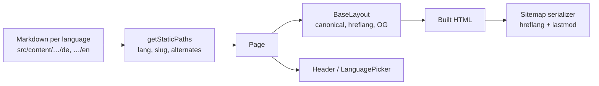

# Internationalization & SEO

How the site handles languages, localized URLs, translations, SEO tags, structured data and the sitemap. Built on Astro's [i18n routing](https://docs.astro.build/en/guides/internationalization/), the [i18n recipe](https://docs.astro.build/en/recipes/i18n/) and [`@astrojs/sitemap`](https://docs.astro.build/en/guides/integrations-guide/sitemap/).

## Contents

- [Overview](#overview)
- [URL structure](#url-structure)
- [Configuration](#configuration)
- [UI translations](#ui-translations)
- [Content translations](#content-translations)
- [Localized route segments](#localized-route-segments)
- [Language selection](#language-selection)
- [SEO tags](#seo-tags)
- [Structured data](#structured-data)
- [Sitemap and robots.txt](#sitemap-and-robotstxt)
- [Internal linking](#internal-linking)
- [Images](#images)
- [Legal pages](#legal-pages)
- [404 page](#404-page)
- [Site config](#site-config)
- [How-to guides](#how-to-guides)
- [Limitations](#limitations)

## Overview

| File | Purpose |
| --- | --- |
| `astro.config.mjs` | Locales, default locale, routing options, sitemap integration |
| `deploy.config.mjs` | Domain (`site`) and base path (`base`), shared with the e2e tests |
| `src/i18n/ui.ts` | UI strings per language, `Lang` type, `languages`, `defaultLang`, `localeMeta` |
| `src/i18n/utils.ts` | `useTranslations`, `getLocalizedPath`, `getHomeAnchor`, `getAlternates` |
| `src/i18n/routes.ts` | Translated URL segments (`kompetenzen` ↔ `competencies`) |
| `src/i18n/sitemap.ts` | Sitemap serializer copying hreflang and `lastmod` from built pages |
| `src/i18n/storage.ts` | localStorage key for the chosen language |
| `src/integrations/site-checks.ts` | Build checks: placeholders, static route files |
| `src/lib/content.ts` | Helpers for translated content entries (paths, alternates, missing-translation check) |
| `src/lib/structured-data.ts` | schema.org JSON-LD builders |
| `src/lib/last-modified.ts` | Last change date of source files (git) |
| `src/site.ts` | Company data, address, contact person, form service, map URL |
| `src/layouts/BaseLayout.astro` | All `<head>` SEO tags |
| `src/components/LanguagePicker.astro` | Language switch |
| `src/components/JsonLd.astro` | Renders structured data |
| `src/content.config.ts` | Content collections and their schemas |

Data flow for a page:



## URL structure

Every page carries a language prefix (`prefixDefaultLocale: true`). All URLs end with a slash (`trailingSlash: 'always'`) and include the `base` path `/schwarz-amp-industrial`.

| Page | German | English | Source |
| --- | --- | --- | --- |
| Root | `/` → redirect | | `src/pages/index.astro` |
| Home | `/de/` | `/en/` | `src/pages/[lang]/index.astro` |
| Competency | `/de/kompetenzen/vermessung/` | `/en/competencies/dimensional-metrology/` | `src/pages/[lang]/[competencies]/[slug].astro` |
| Legal page | `/de/impressum/` | `/en/legal-notice/` | `src/pages/[lang]/[slug].astro` |
| Contact | `/de/kontakt/` | `/en/contact/` | `src/pages/de/kontakt.astro`, `src/pages/en/contact.astro`, see [contact-page.md](./contact-page.md) |
| 404 | `/404.html` | | `src/pages/404.astro` |

Never build URLs by hand. Use `getLocalizedPath`, `getHomeAnchor` or `getEntryPath`; they handle `base`, the language prefix, translated segments and trailing slashes.

## Configuration

`astro.config.mjs`:

```js
i18n: {
  locales: ['de', 'en'],
  defaultLocale: 'de',
  routing: {
    prefixDefaultLocale: true,     // /de/… instead of /…
    redirectToDefaultLocale: false // "/" is handled by src/pages/index.astro
  }
}
```

`src/i18n/ui.ts` reads `locales` and `defaultLocale` from this config via `astro:config/client`, so they're defined only once.

## UI translations

All fixed interface text (navigation, buttons, aria labels, footer, …) lives in `src/i18n/ui.ts`. Page content lives in Markdown, see [Content translations](#content-translations).

```ts
const de = {
  'nav.contact': 'Kontakt',
  // …
} as const;

const en = {
  'nav.contact': 'Contact',
  // …
} as const satisfies UiStrings; // must contain every German key
```

Use it in a component:

```astro
---
import { useTranslations } from '@/i18n/utils';
const t = useTranslations(lang);
---
<a href={getHomeAnchor(lang, 'contact')}>{t('nav.contact')}</a>
```

- German is the reference. A key missing in another language is a **type error** (`npm run check`).
- Keys are grouped by prefix: `brand.*`, `nav.*`, `language.*`, `footer.*`, `breadcrumb.*`, `notFound.*`, `competency.*`, `contact.*` (incl. `contact.form.*`, `contact.map.*`), `seo.*`.
- `t()` falls back to German at runtime if a key is missing.

Components get the language as a `lang` prop from the page; they don't detect it from the URL.

## Content translations

Translated content lives in content collections with one folder per language:

```
src/content/
  pages/        de/home.md, en/home.md                     (home page texts)
  competencies/ de/vermessung.md, en/dimensional-metrology.md, …
  legal/        de/impressum.md, en/legal-notice.md, …
```

- **Folder = language**, **file name = URL slug**. `de/vermessung.md` becomes `/de/kompetenzen/vermessung/`.
- **`translationKey`** links translations of the same entry. It must be identical in all languages and unique within the collection:

  ```yaml
  # de/vermessung.md                      # en/dimensional-metrology.md
  translationKey: "dimensional-metrology"  translationKey: "dimensional-metrology"
  ```

  The key drives the language picker, hreflang tags and the sitemap alternates.

- **Missing translations** are reported during the build:

  ```
  [i18n] competencies "dimensional-metrology" has no translation for: en
  ```

  The page is still built. The language picker links to the other language's home page, and no hreflang is emitted for the missing language.

Helpers in `src/lib/content.ts`:

| Function | Returns |
| --- | --- |
| `getEntryLang(entry)` | Language from the id (`de/vermessung` → `de`) |
| `getEntrySlug(entry)` | Slug from the id (`de/vermessung` → `vermessung`) |
| `getEntryPath(entry)` | Localized URL of the entry |
| `getEntryAlternates(entry, all)` | All translations of the entry |
| `getCompetencies(lang)` | Competencies of one language, sorted by `order` |
| `getLegalPages(lang)` | Legal pages of one language, sorted by `order` |
| `getLegalPageLink(lang, key)` | Title and URL of one legal page, e.g. the privacy policy for the contact form |
| `warnMissingTranslations(entries)` | Logs missing translations |

### Home page frontmatter

`src/content/pages/<lang>/home.md` holds all texts of the home page sections (hero, about, showcase, competencies, quality, contact banner) plus `title` and `description` for SEO. The Markdown body is the "about" text. See the `pages` schema in `src/content.config.ts` for the full field list.

- `heroImage` and `showcaseImage` are paths to `src/assets/images/`, relative to the Markdown file (e.g. `../../../assets/images/hero-image.jpg`). See [Images](#images).
- The contact banner links to the contact page; there is no link field in the frontmatter.
- `primaryCtaHref` / `secondaryCtaHref` are anchors on the same page (`#services`, `#contact`).

### Competency frontmatter

| Field | Required | Purpose |
| --- | --- | --- |
| `translationKey` | yes | Links translations |
| `number` | yes | Display number, e.g. `"02"` |
| `title` | yes | Heading and list title |
| `teaser` | yes | Short text in lists and under the heading |
| `order` | yes | Sort order |
| `seoTitle` | yes | `<title>`, ideally ≤ 60 characters, ending in `\| AMP` |
| `seoDescription` | yes | Meta description, ideally 120–160 characters |
| `ogImage` | no | Social preview image, path relative to the Markdown file (e.g. `../../../assets/images/x.jpg`) |

## Localized route segments

Route segments that differ per language are defined in `src/i18n/routes.ts`:

```ts
export const routes = {
  competencies: { de: 'kompetenzen', en: 'competencies' },
  contact: { de: 'kontakt', en: 'contact' },
};

export const staticRoutes = ['contact'];
```

The dynamic folder `src/pages/[lang]/[competencies]/` receives the translated segment as a param from `getStaticPaths`. Every route key must have an entry for each language (type-checked).

`contact` is the exception: the contact page uses static route files (`src/pages/de/kontakt.astro`, `src/pages/en/contact.astro`), because a dynamic `[lang]/[contact]/` route would clash with the legal pages route `[lang]/[slug].astro`. Such routes are listed in `staticRoutes` in `src/i18n/routes.ts`; the build fails if their files don't match the segments in `routes` (`src/integrations/site-checks.ts`). `routes.contact` is still used to build links with `getLocalizedPath(lang, 'contact')`.

## Language selection

### Root redirect (`/`)

`src/pages/index.astro` redirects to:

1. the language last chosen in the language picker (localStorage key `amp-lang`),
2. otherwise the first browser language that's supported (`navigator.languages`),
3. otherwise the default language `de`. This is also the no-JavaScript fallback.

The page is `noindex`, has a canonical pointing to `/de/` and is excluded from the sitemap.

### Language picker

`LanguagePicker.astro` links to the current page in each language, using the page's `alternates`. Languages without a translation link to their home page. Clicking a language stores it for the root redirect.

Each page passes its alternates to both `BaseLayout` (hreflang) and `Header` (language picker):

- pages with the same route in every language: `getAlternates()`,
- content entries: `getEntryAlternates(entry, allEntries)`.

## SEO tags

`BaseLayout.astro` renders every SEO-relevant tag in `<head>`:

| Tag | Source |
| --- | --- |
| `<html lang>` | `lang` prop |
| `<title>`, `og:title`, `twitter:title` | `title` prop |
| `<meta name="description">`, `og:description` | `description` prop, fallback `seo.defaultDescription` |
| `<link rel="canonical">` | URL of the current language from `alternates` |
| `<link rel="alternate" hreflang>` | One per translation, plus `x-default` → German version. Only rendered if a page has more than one language |
| `og:locale`, `og:locale:alternate` | `localeMeta[lang].ogLocale` (`de_DE`, `en_US`) |
| `og:type` | `type` prop (`website` or `article` for competencies) |
| `og:image` (+ width/height/alt) | `image` prop or the hero image, cropped to 1200×630 JPG by `astro:assets` |
| `og:updated_time`, `article:modified_time` | `lastModified` prop, see [Sitemap](#lastmod) |
| `<meta name="robots" content="noindex">` | `noindex` prop |
| Favicon, Apple touch icon | `public/favicon.svg`, `public/apple-touch-icon.png` |
| `<link rel="sitemap">` | Always |

Page-specific tags go into the layout's `head` slot:

```astro
<BaseLayout lang={lang} title="…" alternates={alternates}>
  <JsonLd slot="head" data={…} />
  …
</BaseLayout>
```

## Structured data

JSON-LD built with `src/lib/structured-data.ts` and rendered with `<JsonLd slot="head" data={…} />`:

| Page | Types |
| --- | --- |
| Home | `Organization`, `WebSite` |
| Competency | `Service`, `BreadcrumbList` |
| Legal page | `BreadcrumbList` |
| Contact | `Organization`, `ContactPage`, `BreadcrumbList` |

The `Organization` includes a `ContactPoint` and, once `site.address` is filled in, a `PostalAddress`.

All nodes reference the organization by a stable id (`…/de/#organization`). Company data comes from `src/site.ts`. Validate with Google's [Rich Results Test](https://search.google.com/test/rich-results) or the [Schema Markup Validator](https://validator.schema.org/).

## Sitemap and robots.txt

`@astrojs/sitemap` generates `sitemap-index.xml` and `sitemap-0.xml` at build time.

- **Alternates:** the integration's own `i18n` option only pairs pages with identical paths, so it can't handle localized slugs. Instead, `createSitemapSerializer` (`src/i18n/sitemap.ts`) reads each built page and copies its hreflang links into the sitemap. The sitemap therefore always matches the page headers.
- **Excluded:** the root redirect page and the 404 page.

### lastmod

`getLastModified(...files)` returns the date of the latest git commit touching a page's source files (or the file modification time for files that were never committed). Pages pass it as `lastModified` to `BaseLayout`, which renders `og:updated_time`. The sitemap serializer copies that into `<lastmod>`.

| Page | Source files |
| --- | --- |
| Home | its `home.md` and all competencies of that language |
| Competency / legal page | its Markdown file |
| Contact | `src/components/ContactPage.astro`, `src/site.ts` and `src/i18n/ui.ts` |

The deploy workflow checks out the full history (`fetch-depth: 0`), otherwise every page would get the date of the latest commit.

### robots.txt

`src/pages/robots.txt.ts` allows all crawlers and points to the sitemap. Crawlers only read `robots.txt` at the domain root, so it takes effect once the site runs on its own domain.

## Internal linking

Each competency page ends with a "related" section (`CompetenciesSection` with `id="related"`) listing the other competencies of the same language, with the headings `competency.relatedEyebrow` / `competency.relatedTitle`. Header and footer link to the home page sections of the current language via `getHomeAnchor`, and to the contact page via `getLocalizedPath(lang, 'contact')`. The contact banner on the home page and the sidebar on competency pages link to the contact page too.

## Images

Content images live in `src/assets/images/` and are referenced from frontmatter with paths relative to the Markdown file. The schema validates them with `image()`, and `Hero.astro` / `ImageShowcase.astro` render them with `<Image>` from `astro:assets`, which generates WebP files in several widths with `srcset`/`sizes`.

Files in `public/` are served unprocessed; only use it for files that need a fixed URL (favicon, logo for structured data).

## Legal pages

Collection `legal` (`src/content/legal/<lang>/*.md`) with `translationKey`, `title`, `description` and `order`. The footer lists the legal pages of the current language, sorted by `order`. They're rendered by `src/pages/[lang]/[slug].astro`.

> The current Impressum and privacy policy are **templates**. All `[placeholders]` must be filled in and the texts legally reviewed before going live.

## 404 page

`src/pages/404.astro` becomes `404.html`, which GitHub Pages serves for every unknown URL. Since one file serves all languages, it shows the message in every language, each linking to its home page. It's `noindex`.

## Site config

`src/site.ts` holds company data used by the footer, the contact page and structured data:

```ts
export const site = {
  name: 'AMP',
  company: 'AMP Prüftechnik',
  email: 'info@amp-zfp.de',
  phone: { display: '+49 7443 9665-19', href: 'tel:+497443966519' },
  logo: '/images/logo-amp.png',
  address: { street: '…', postalCode: '…', city: '…', country: 'DE' },
  contactPerson: { name: '…', email: '…', phone: { … } },
  contactForm: { endpoint: '…', hiddenFields: {}, honeypot: 'botcheck', subjectField: 'subject' },
  mapEmbedUrl: '',
};
```

Address, contact person, form service and map are explained in [contact-page.md](./contact-page.md#setup-checklist).

Markdown can't import it, so the legal pages repeat email and phone.

## How-to guides

### Add a UI string

1. Add the key to `de` in `src/i18n/ui.ts`.
2. Add the same key to every other language (`npm run check` fails otherwise).
3. Use it with `t('your.key')`.

### Add a competency

1. Create `src/content/competencies/de/<german-slug>.md` and `src/content/competencies/en/<english-slug>.md`.
2. Give both the same `translationKey` and fill in all [frontmatter fields](#competency-frontmatter).
3. Run `npm run build` and check that no `[i18n]` warning appears.

The home page list, detail pages, language picker, hreflang, sitemap and structured data update automatically.

### Add a legal page

Create `src/content/legal/<lang>/<slug>.md` for every language with a shared `translationKey` and an `order` for the footer position.

### Add a localized section with its own route segment

1. Add the segment to `src/i18n/routes.ts`, e.g. `news: { de: 'aktuelles', en: 'news' }`.
2. Add a content collection in `src/content.config.ts` with a `translationKey` field.
3. Add the collection and route key to `collectionRoutes` and `TranslatedCollection` in `src/lib/content.ts`.
4. Create `src/pages/[lang]/[news]/[slug].astro`, modeled on the competency page.

### Add a language

1. Add the locale to `i18n.locales` in `astro.config.mjs`.
2. Add a full string set to `ui` and an entry to `localeMeta` in `src/i18n/ui.ts`.
3. Add the segment for every route in `src/i18n/routes.ts`.
4. Add a content folder for the language in every collection (`pages/<lang>/home.md`, competencies, legal pages).
5. Run `npm run check` and `npm run build`; type errors and `[i18n]` warnings show what's missing.

### Move to your own domain

1. In `deploy.config.mjs`, set `site` to the domain, e.g. `https://www.amp-zfp.de`, and `base` to `''`.
2. Nothing else in the code: `astro.config.mjs` (incl. sitemap) and the e2e tests read both values from there.
3. Configure the domain in the GitHub Pages settings.

Canonical URLs, hreflang, the sitemap, `robots.txt` and structured data follow automatically.

## Limitations

- **Dev server and schema changes:** after editing `src/content.config.ts`, restart `npm run dev`. Its content cache can keep entries that failed validation in the meantime out of the site.
- **`lastmod` for local builds:** a committed file with uncommitted changes still reports its last commit date. CI builds from commits, so production is correct.
- **robots.txt** has no effect while the site lives under `luca2409.github.io/schwarz-amp-industrial`.
